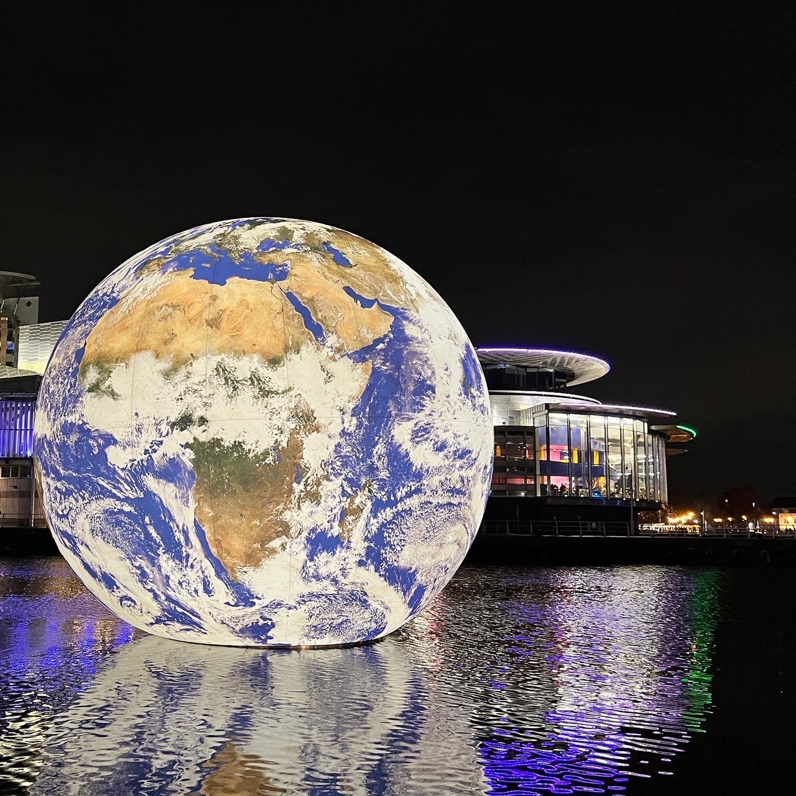

**</Alternative (Alt) text** is a description of an image and is important in accessible web design to describe images to people who are unable to see them. The text will not appear on the webpage but will be read aloud by screen readers.

  
Add the alt property to provide alternative text for people who cannot view the image.
  
--- code ---
---
language: html
filename: index.html
line_numbers: false
---       
  

--- /code ---
  

