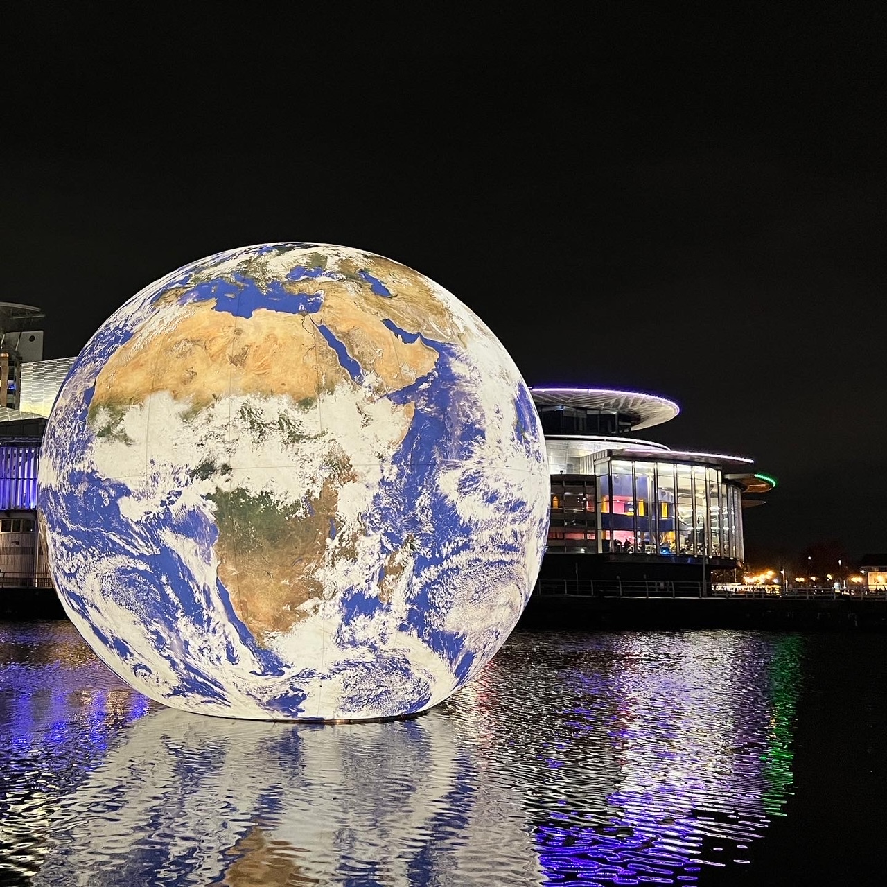

**Le texte alternatif (alt) est une description d'une image. Le texte Alt est un élément important de la conception de sites web accessibles, car il décrit les images aux personnes qui ne peuvent pas les voir. Le texte n'apparaît pas sur la page web, mais il est lu à haute voix par les lecteurs d'écran.

Ajoute la propriété alt pour fournir un texte alternatif aux personnes qui ne peuvent pas voir l'image.

--- code ---
---
language: html
filename: index.html
line_numbers: false
--- 

--- /code ---

